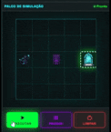
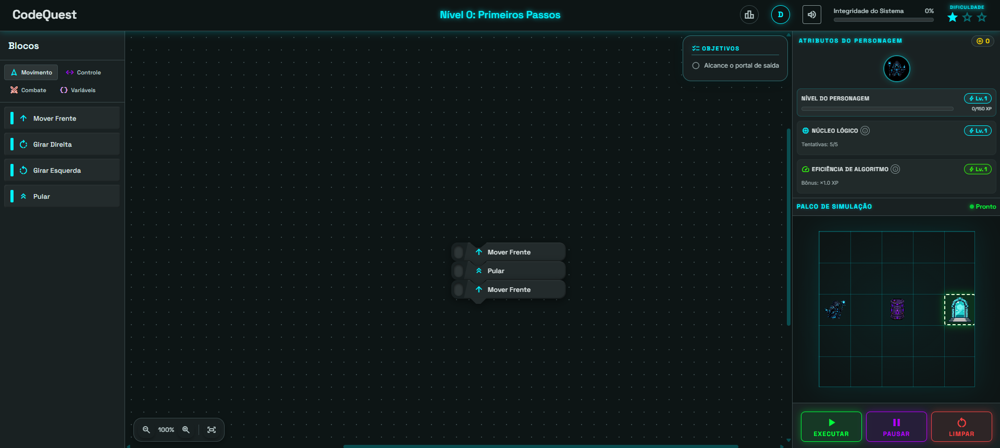
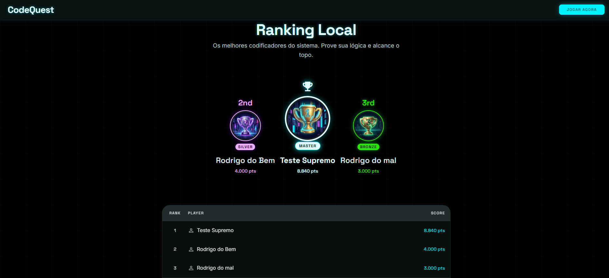
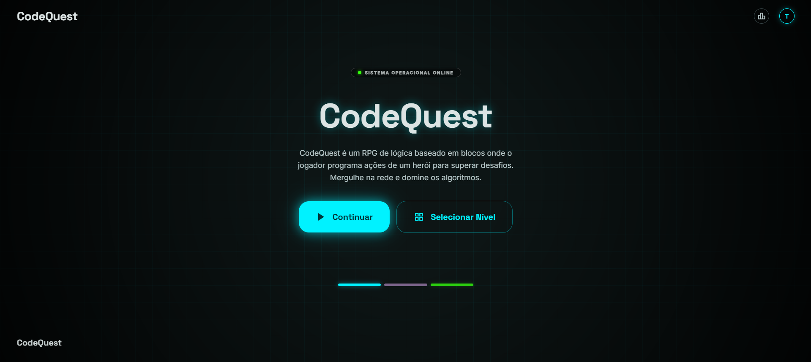

<div align="center">

# 🤖 CodeQuest — Cidade da Lógica

### _Um RPG de lógica baseado em blocos_

[](https://developer.mozilla.org/pt-BR/docs/Web/HTML)
[](https://developer.mozilla.org/pt-BR/docs/Web/CSS)
[](https://developer.mozilla.org/pt-BR/docs/Web/JavaScript)
[](https://opensource.org/licenses/MIT)
[](#)
[](#)

<br>



<br>

[⚡ Começar](#-como-jogar)
• [📖 Sobre](#-sobre)
• [🎮 Funcionalidades](#-funcionalidades)
• [🧩 Blocos](#-blocos-disponíveis)
• [🏗️ Arquitetura](#%EF%B8%8F-arquitetura)
• [📁 Estrutura](#-estrutura-do-projeto)
• [🤝 Contribuir](#-contribuindo)

</div>

---

## 📖 Sobre

Em um mundo digital onde algoritmos governam tudo, a **Cidade da Lógica** está sob ameaça. Você é um programador em ascensão. Comande o robô **Autômato** através de desafios codificados, arrastando e encaixando blocos de código visual para superar obstáculos, derrotar inimigos e restaurar a ordem no sistema.

CodeQuest é um **RPG educativo de programação** que ensina lógica computacional sem exigir conhecimento prévio de código — perfect para iniciantes em algoritmo e pensamento computacional.

> 🎯 **Objetivo:** Arraste blocos da paleta para o workspace, forme uma sequência de comandos e execute para guiar o herói até o portal de saída enquanto cumpre os objetivos de cada nível.

---

## 🎮 Funcionalidades

| Funcionalidade | Descrição |
|----------------|-----------|
| 🧩 **Programação Visual** | Arraste e encaixe blocos para criar programas — sem digitar código |
| 🤖 **9 Tipos de Bloco** | Movimento, Controle (`if`/`repeat`/`while`), Combate e Variáveis |
| 🎮 **9 Níveis Progressivos** | Grid variável (5×5 a 7×7), dificuldade crescente com inimigos e obstáculos |
| 👾 **3 Tipos de Inimigo** | LaserBot, Torre (Turret) e Patrulha (Patrol) — cada um com comportamento único |
| 📊 **Sistema de Atributos** | Núcleo Lógico (tentativas extras) e Eficiência de Algoritmo (multiplicador de XP) |
| 🏆 **Ranking S/A/B/C** | Pontuação baseada em eficiência de blocos, com XP e estrelas |
| 🎵 **Trilha Sonora Dinâmica** | Músicas que mudam conforme o tema do nível + efeitos sonoros |
| 💾 **Múltiplos Perfis** | Saves independentes com progresso persistente via `localStorage` |
| 📖 **Tutorial Interativo** | Demonstração guiada dos objetivos e blocos para novos jogadores |
| 🌐 **100% Estático** | Sem build, sem servidor — apenas abrir `index.html` no navegador |

---

## 🖼️ Capturas de Tela

<div align="center">
  <table>
    <tr>
      <td align="center">
        
        <br>
        <em>Grid de simulação + workspace de blocos</em>
      </td>
      <td align="center">
        
        <br>
        <em>Pódio e ranking de pontuações</em>
      </td>
    </tr>
    <tr>
      <td align="center" colspan="2">
        
        <br>
        <em>Tela inicial / demonstração geral</em>
      </td>
    </tr>
  </table>
</div>

---

## ⚡ Como Jogar

🌐 **Jogar online:** [emanuel378.github.io/CodeQuest](https://emanuel378.github.io/CodeQuest/)

Ou rode localmente:

```bash
# Clone o repositório
git clone https://github.com/emanuel378/CodeQuest.git

# Navegue até a pasta
cd CodeQuest

# Abra no navegador (sem build necessário!)
start index.html
```

**Fluxo básico:**

1. 🏠 Na **página inicial**, crie ou selecione um perfil
2. 🎯 Escolha um **nível** — cada um tem objetivos específicos
3. 🧩 **Arraste blocos** da paleta para o workspace
4. 🔗 **Encaixe os blocos** formando uma sequência lógica
5. ▶️ **Execute** para ver o robô realizar os comandos no grid
6. ⭐ Complete os **objetivos** e avance para o próximo nível!

---

## 🧩 Blocos Disponíveis

| Categoria | Cor | Blocos |
|-----------|-----|--------|
| **Movimento** | Ciano | `Mover Frente`, `Girar Direita`, `Girar Esquerda`, `Pular` |
| **Controle** | Roxo | `Se / Senão`, `Repetir N vezes`, `Enquanto` |
| **Combate** | Vermelho | `Atacar` (causa 1 de dano ao inimigo à frente) |
| **Variáveis** | Roxo | `Variável personalizada` |

**Exemplo de programa:**

```
Mover Frente     → anda 1 casa
Girar Direita    → rotaciona 90°
Mover Frente     → anda mais 1
Atacar           → ataca inimigo à frente
```

---

## 🏗️ Arquitetura

```
[Hash Router] → Rota /game → GamePage → dispatches game:ready
                                          ↓
                                 app.js orquestra módulos
                              ┌────┬────┬────┬────┬────┐
                            engine game stage actors  ui
                              │     │     │     │     │
                          validator levels grid  player router
                          runner   prog   colisão   pages
                                   attr   inimigos  block*
                                   perfis          palette
                                                    workspace
```

### Separação de Camadas

| Camada | Pasta | Responsabilidade | Acessa DOM? |
|--------|-------|------------------|:-----------:|
| **Engine** | `js/engine/` | Validação e execução de comandos | ❌ |
| **Game** | `js/game/` | Lógica de níveis, progressão, atributos | ❌ |
| **Stage** | `js/stage/` | Grid, colisão, inimigos, objetivos | ❌ |
| **Actors** | `js/actors/` | Estado do herói (posição, direção, HP) | ❌ |
| **UI** | `js/ui/` | Componentes visuais, blocos, páginas | ✅ |
| **App** | `app.js` | Orquestração e coordenação | ✅ |

> **Regra de ouro:** Arquivos em `engine/`, `game/`, `stage/` e `actors/` **nunca** acessam DOM. Arquivos em `ui/` **nunca** contêm lógica de jogo. `app.js` é o único coordenador.

---

## 🛠️ Tecnologias

- **HTML5** — Semântico, acessível, templates `<template>` para SPA
- **CSS3** — Glassmorphism, variáveis CSS, `backdrop-filter`, `aspect-ratio`, Grid/Flexbox
- **JavaScript ES6+** — Módulos `type="module"`, Classes, `async/await`, Drag & Drop nativo
- **ZERO frameworks** — Sem React, Vue, jQuery ou bibliotecas runtime
- **ZERO build step** — Apenas abrir `index.html`

### Dependências Externas

| Recurso | Uso |
|---------|-----|
| [Google Fonts: Space Grotesk](https://fonts.google.com/specimen/Space+Grotesk) | Tipografia de manchetes e labels |
| [Google Fonts: Inter](https://fonts.google.com/specimen/Inter) | Tipografia de corpo |
| [Material Symbols](https://fonts.google.com/icons) | Ícones dos blocos e interface |

---

## 📁 Estrutura do Projeto

```
codequest/
├── index.html                  # SPA com templates de página
├── styles/
│   ├── main.css                # Orquestrador de imports
│   ├── design-system.css       # Tokens CSS (cores, tipografia, etc.)
│   ├── blockly.css             # Workspace + blocos + paleta
│   ├── stage.css               # Grid RPG + simulação + controles
│   ├── pages.css               # Transições de página + ranking
│   └── landing.css             # Landing page
├── js/
│   ├── app.js                  # Init, orquestração, event listeners
│   ├── engine/
│   │   ├── validator.js        # Validação de comandos
│   │   └── runner.js           # Executor assíncrono
│   ├── actors/
│   │   ├── player.js           # Estado do herói
│   │   └── enemy.js            # Tipos de inimigo
│   ├── stage/
│   │   └── stage.js            # Grid + colisão + objetivos
│   ├── game/
│   │   ├── levels.js           # Definição das fases
│   │   ├── progression.js      # Desbloqueio + pontuação
│   │   ├── attributes.js       # Sistema de atributos
│   │   └── playerManager.js    # Múltiplos perfis
│   ├── audio/
│   │   └── audioManager.js     # Músicas + SFX
│   └── ui/
│       ├── router.js           # HashRouter SPA
│       ├── routes.js           # Mapeamento de rotas
│       ├── pages/              # PageComponents (landing, game, ranking)
│       ├── blockWorkspace.js   # Workspace de blocos
│       ├── blockPalette.js     # Paleta por categoria
│       ├── gameTutorial.js     # Tutorial interativo
│       └── ...
├── assets/
│   ├── sprites/                # PNGs do jogador, inimigos, itens, etc.
│   ├── sounds/                 # Músicas + SFX
│   └── img/                    # Screenshots para o README
├── docs/game/                  # Documentação do jogo (9 subsistemas)
├── AGENTS.md                   # Instruções para agentes IA
├── ARCHITECTURE.md             # Documentação de arquitetura
├── DESIGN.md                   # Design system tokens + regras
└── GAME.md                     # Índice da documentação do jogo
```

---

## 🎯 Roadmap

- [x] Motor de blocos com drag & drop nativo
- [x] 9 níveis com grid variável e progressão
- [x] Sistema de atributos e ranking
- [x] Tutorial interativo
- [x] Múltiplos perfis de jogador
- [x] Áudio dinâmico por tema
- [ ] **Editor de níveis** — criar fases customizadas
- [ ] **Desafios diários** — níveis gerados proceduralmente
- [ ] **Multi-idioma** — suporte a EN/ES/FR
- [ ] **Versão mobile** — touch events para drag & drop
- [ ] **Achievements** — sistema de conquistas desbloqueáveis
- [ ] **Modo speedrun** — timer + ranking por tempo

---

## 🤝 Contribuindo

### Convenções

- **Commits:** [Conventional Commits](https://www.conventionalcommits.org/) — `feat:`, `fix:`, `docs:`, `chore:`
- **Código:** ES6+ Classes (PascalCase), arquivos em camelCase, sem comentários desnecessários
- **CSS:** Usar **apenas** variáveis do `DESIGN.md` — sem cores ou espaçamentos hardcoded

### Regras de Arquitetura

| Regra | Descrição |
|-------|-----------|
| **Sem DOM em engine/** | `engine/`, `game/`, `stage/`, `actors/` NUNCA acessam `document`, `window`, eventos DOM |
| **Sem lógica de jogo em ui/** | `ui/` NUNCA contém condições de vitória, colisão ou estado do herói |
| **Coordenador único** | `app.js` é o único arquivo que importa engine + UI |

### Skills para Agentes IA

Este repositório usa [opencode.ai](https://opencode.ai) com skills especializadas:

| Skill | Quando usar |
|-------|-------------|
| `architecture-compliance` | Ao trabalhar em `engine/`, `ui/` ou `app.js` |
| `design-system` | Ao trabalhar em `styles/` ou componentes UI |
| `game-logic` | Ao trabalhar em `game/`, níveis ou progressão |
| `code-style` | Ao criar ou editar arquivos JavaScript |
| `block-catalog` | Ao adicionar novos blocos ao catálogo |

### Primeiros Passos

```bash
git clone https://github.com/seu-usuario/codequest.git
cd codequest
# Faça suas alterações
# Teste abrindo index.html no navegador
git add .
git commit -m "tipo: descrição concisa"
git push origin sua-branch
```


<div align="center">

Feito com ❤️ para ensinar lógica de programação

**Autores:** Emanuel · João Filipe · Lucas Santana · Renato

_CodeQuest — O algoritmo da vitória está em suas mãos._

</div>
